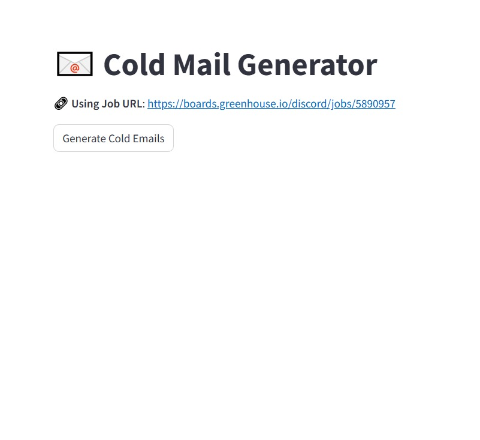
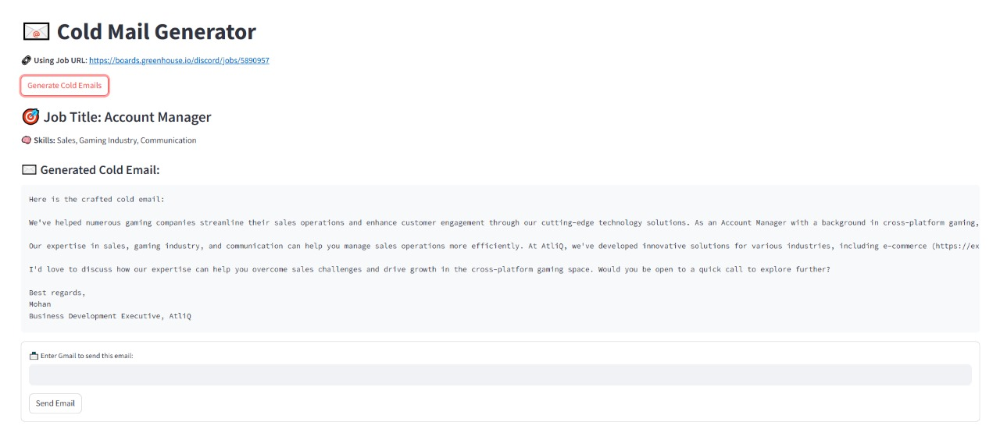
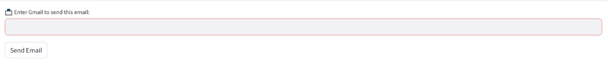

# 📧 Cold Email Generator

An AI-powered Cold Email Generator that scrapes job descriptions from company websites, extracts job roles and required skills using LLM (LLaMA3 via Groq API), matches them with your portfolio using ChromaDB, and generates personalized cold emails — all with a single click. You can even send the email directly via Gmail SMTP.

---

## 🚀 Features

- 🌐 Scrape job listings from career websites
- 🧠 Extract roles, skills, experience using LLaMA3 (Groq)
- 📎 Match job requirements to your personal portfolio
- ✉️ Generate cold emails tailored to each job
- 📬 Send emails directly through Gmail SMTP
- ⚡ Built with LangChain, ChromaDB, Streamlit

---

## 🖼️ Demo Screenshots

### 🏠 Home Page


### ✨ Generated Emails


### 📤 Gmail Input Box


---

## ⚙️ Setup Instructions

1. **Clone the repository**
   ```bash
   git clone https://github.com/AroonKumarr/cold-email-generator.git
   cd cold-email-generator
Create a .env file in the root directory with:

ini
Copy
Edit
GROQ_API_KEY=your_groq_api_key
YOUR_EMAIL=your_email@gmail.com
EMAIL_PASSWORD=your_gmail_app_password
Install requirements

bash
Copy
Edit
pip install -r requirements.txt
Run the app

bash
Copy
Edit
streamlit run app/main.py
🧠 Tech Stack
Python

LangChain

Streamlit

ChromaDB

LLaMA3 (via Groq API)

FAISS / Sentence Transformers

Gmail SMTP

📁 Project Structure
bash
Copy
Edit
cold-email-generator/
│
├── app/
│   ├── main.py
│   ├── chain.py
│   ├── portfolio.py
│   ├── utils.py
│   ├── resource/
│   │   └── my_portfolio.csv
│   ├── vectorstore/
│   │   └── chroma.sqlite3
│
├── assets/
│   ├── homepage.jpg
│   ├── generating_emails.jpg
│   └── gmail_input_box.jpg
│
├── .env               # Not included in GitHub
├── .gitignore
├── README.md
└── requirements.txt
📬 Contact
Aroon Kumar
📧 aroonk644@gmail.com
🌐 LINKEDIN.COM/IN/AROON-KUMAR-38507528A/